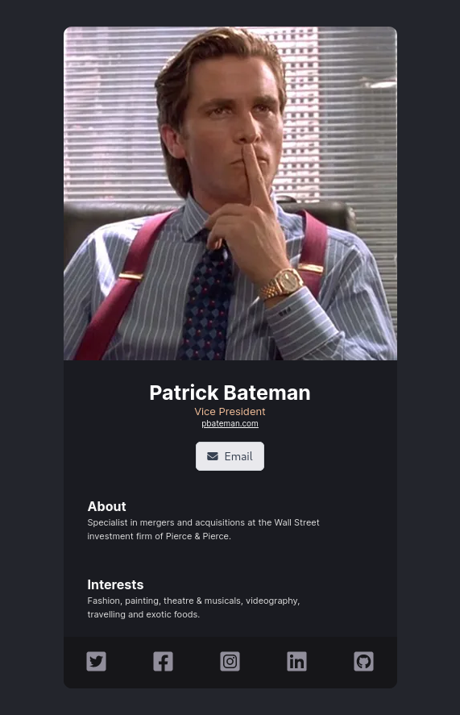

# 🪪 Contact card

## 💡 About

Simple contact card created in React to try out and
get a hands on experience with the library.   
This project is part of the "Learn React for free"
course avaiable on [scrimba.com](https://scrimba.com/learn/learnreact) or
on [YouTube](https://youtu.be/bMknfKXIFA8?t=8450).
The goal of this exercise is to create website according
to the existing design
[(available here)](https://www.figma.com/file/4ctPLUvIn5b5Ep6YPOZWWd/Digital-Business-Card?node-id=0%3A1).

## 🧰 Used technologies

- **HTML** - site layout
- **CSS** - styling
- **React** - components
- **Vite** - build system for Javascript and quick project setup

## 🖼️ Screenshot of application

## ⚙️ Instructions for running

- requires instalation of [Node.js](https://nodejs.org/en/)
- `npm install` - installing dependencies
- `npm run dev` - running local server (by default on `localhost:3000`)
- `npm run build` - building the project for the production